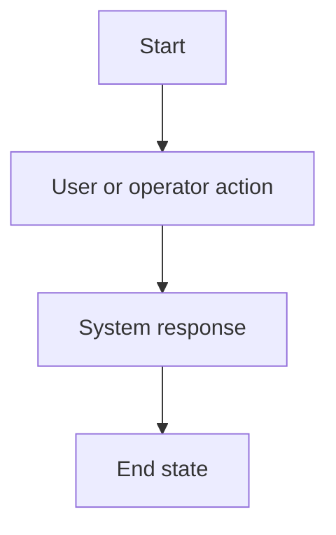
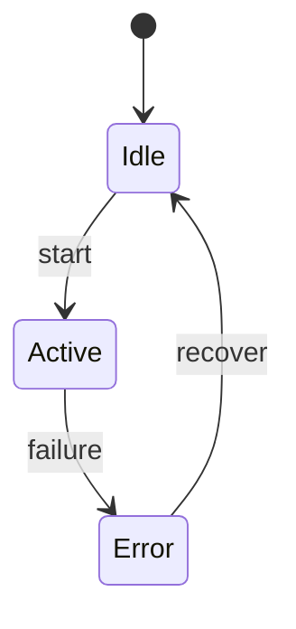
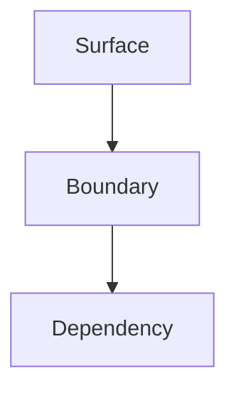

# <Clear Design Title>

## Human Review Summary

- What We Are Building:
  - <short, concrete behavior / surface summary>
- Why This Design:
  - <why this direction fits the approved requirements>
- Human Approval Needed For:
  - <behavior, interaction, boundary, or accepted risk>

## Problem Frame

[Short restatement of the approved problem and intended outcome]

## Design Scope

- Owner Mode: <product-led | engineering-led>
- Design Focus: <what ambiguity this design pass removes before planning>

## Design Goals

- [Goal tied to user, operator, or system experience]
- [Goal tied to clarity, safety, or maintainability]

## Requirements Trace

- R1. [Requirement carried forward]
- R2. [Requirement carried forward]

## Flow

[Describe the user or system flow. Use prose, table, or diagram when it improves clarity.]

Recommended Mermaid flowchart when the path has more than one meaningful step:

## Interaction Model

| Actor | Action | System Response | Notes |
|---|---|---|---|
| <user/operator/system> | <action> | <response> | <note> |

## States And Failure Handling

| State | Trigger | User / Operator Visible Behavior | Recovery Or Next Step |
|---|---|---|---|
| <state> | <trigger> | <visible behavior> | <recovery> |

Recommended Mermaid state diagram when state transitions matter:

## Interfaces And Boundaries

- [Important interface boundary]
- [What is inside scope versus delegated to another surface]

Use a table or graph when multiple surfaces or components interact:

| Surface Or Component | Responsibility | Explicit Non-Responsibility |
|---|---|---|
| <surface> | <responsibility> | <non-responsibility> |

## Key Design Decisions

- [Decision]: [Why it was chosen]
- [Decision]: [What alternative was rejected]

## Operational Considerations

- [Rollout, retry, migration, configuration, or failure-mode concern that affects design]

## Human Review Checklist

- The intended behavior is understandable without chat context: <yes | no>
- User/operator interactions are explicit: <yes | no>
- Important states and failures are explicit: <yes | no>
- Boundaries and non-goals are explicit: <yes | no>
- Remaining decisions are listed in the right section: <yes | no>
- Diagrams/tables are used where they materially improve reviewability: <yes | no | not needed>

## Open Questions

### Resolve Before Planning

- [Question that changes implementation shape enough to block planning]

### Deferred To Planning

- [Question that can responsibly be answered during planning]

## Design Quality Gate

- Flow clarity: [strong | weak | needs revision]
- State completeness: [strong | weak | needs revision]
- Boundary clarity: [strong | weak | needs revision]
- User or operator clarity: [strong | weak | needs revision]
- Operability realism: [strong | weak | needs revision]
- Ambiguity left for implementer: [acceptable | too high]

## Challenge Decision

- Challenge Mode: design
- Human approval readiness: [ready_for_human_approval | revise]
- Must fix before human design approval: [short summary or "none"]
- Challenge Summary Path: <path or "pending">
- Challenge Disposition Path: <path or "pending">

## Next Step

- `cmon:challenge(mode=design)` before human approval
- `human_design_approval` after challenge passes
- `cmon:plan` only after human design approval
- resume `cmon:design` when design blockers remain
